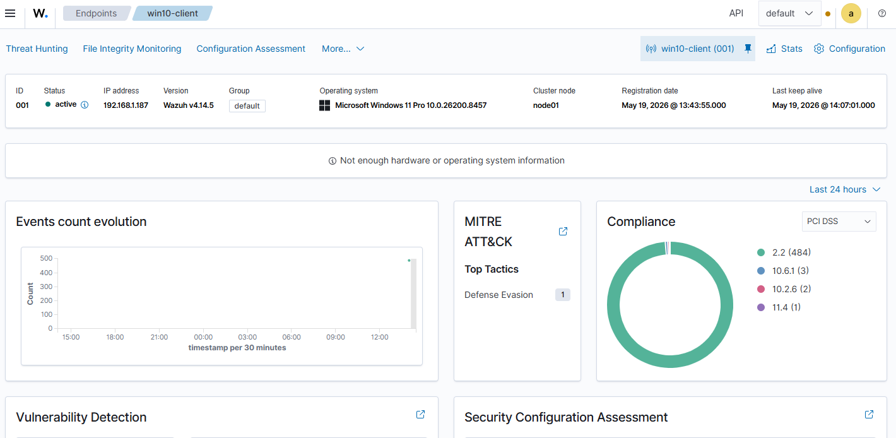
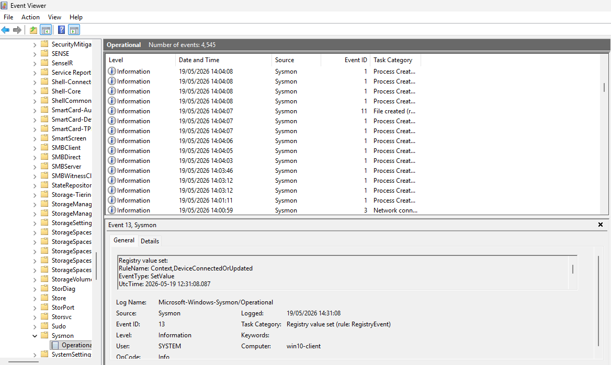
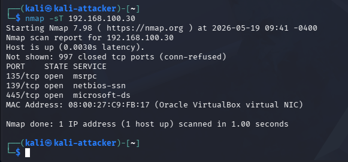
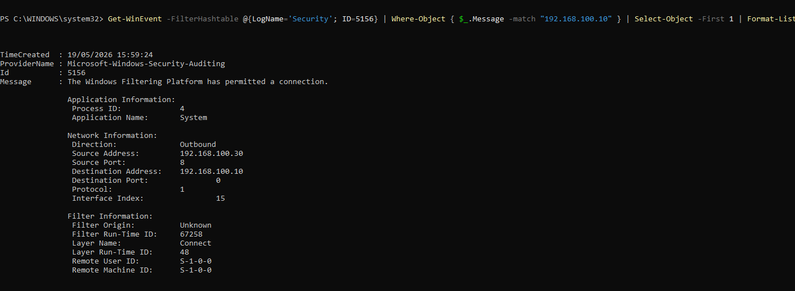
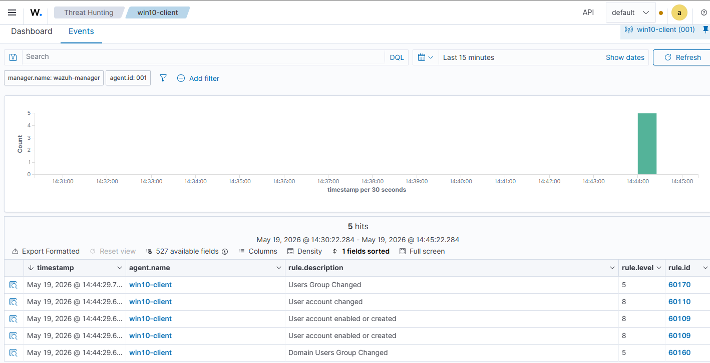

# home-soc-lab
Building a home SOC lab with Wazuh, Sysmon and real attack simulations

A hands-on Security Operations Center (SOC) home lab designed to simulate real-world cyber attacks, generate security telemetry, and improve threat detection and incident response skills.

## Project Goals
- Build a realistic SOC environment
- Collect and analyze Windows and Linux security logs
- Detect malicious activity using SIEM rules
- Simulate real-world attack scenarios
- Improve incident investigation skills
  
## Lab Architecture
| Machine | Role |
|---------|------|
| Kali Linux | Attacker |
| Windows 10 | Victim |
| Ubuntu Server | Wazuh SIEM |

## Tools Used
- Wazuh
- Sysmon
- VirtualBox
- Kali Linux
- Ubuntu Server
- Windows Event Viewer
- Nmap

## Current Attack Simulations

- [ ] Port Scanning Detection
- [ ] Brute Force Detection
- [ ] Suspicious PowerShell Execution
- [ ] Privilege Escalation Attempts

## Screenshots

The Wazuh dashboard with the Windows agent active and showing its details.

Sysmon events in the Windows Event Viewer, mainly process creation.

Running an nmap TCP connect scan from Kali to the Windows machine.

Windows Security event 5156 where the Kali IP appears in the log.

A custom alert in Wazuh for port scanning activity, mapped to MITRE T1046.

## MITRE ATT&CK Mapping

This lab will include detections mapped to:

- T1059 – Command and Scripting Interpreter
- T1110 – Brute Force
- T1046 – Network Service Discovery

## Challenges and lessons learned

- Wazuh installer warned about Ubuntu 26.04 not being officially supported. I used `-i` to skip the check and it worked.
- The Windows agent tried to connect to the internal IP (192.168.100.20) instead of the bridge IP. Editing `ossec.conf` fixed it.
- Sysmon did not log incoming SYN scans. I switched to `nmap -sT` and relied on Windows Filtering Platform events (5156).
- The Wazuh agent on Windows could not read the Security log channel. I ended up checking logs manually with PowerShell. Not perfect, but it confirmed the scan was detected.
- Writing custom rules and testing them is slower than expected. But when the alert finally showed up, it was satisfying.
